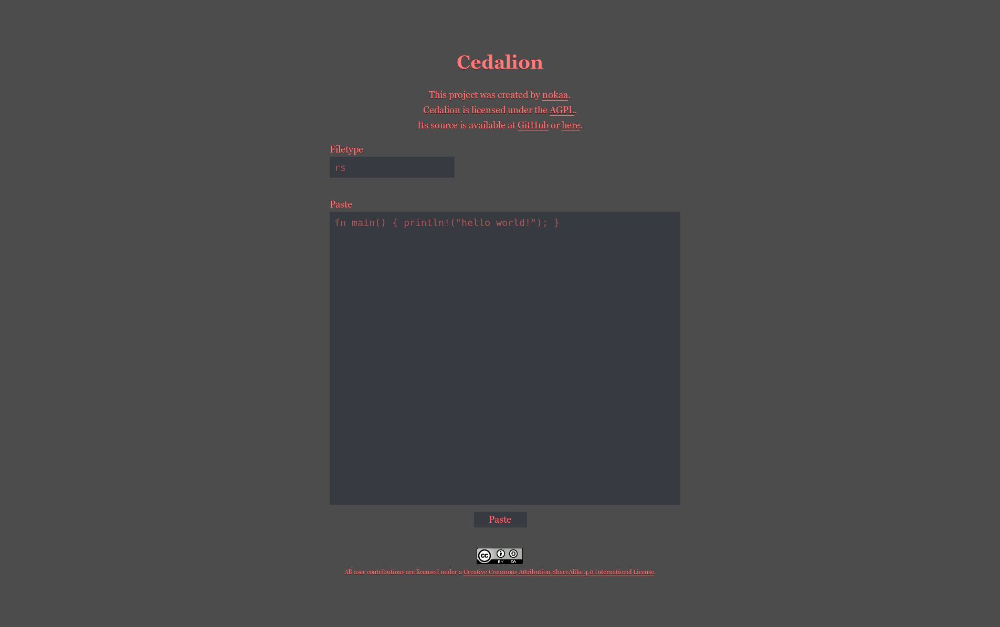

# Cedalion 
Cedalion is a pastebin clone written in Rust using [rotor-http](https://github.com/tailhook/rotor-http), [chomp](https://github.com/m4rw3r/chomp), and [diesel](https://github.com/sgrif/diesel).

The webpages use [Erato](https://github.com/nokaa/erato), a minimalistic stylesheet.

I would host an interactive version but my server is ARM based, and there are currently issues with compiling Cedalion on ARM.

### Install
NOTE: Cedalion currently will not build on ARM due to an issue with [nix](https://github.com/nix-rust/nix). The nix repo builds properly, but the version on crates.io (0.4.2) fails. Unfortunately this is not my dependency, but is a dependency of Mio. It may be possible to do this by packaging the necessary crates yourself, but I have yet to test this.
Cedalion requires PostgreSQL with a database named `cedalion`. You can create this by running `createdb cedalion`.

Cedalion requires Rust Nightly. If you don't already have nightly, I recommend using [multirust](https://github.com/brson/multirust) to get it.

Next you need to install Diesel's cli tool: `cargo install diesel_cli`.

Run `diesel migration run` to create the table. Now we can `cargo build` to build the project, and `cargo run` to run the server.

Note: If you plan on using this, you should run `cargo build --release` and `cargo run --release`.

### TODO
- Add html viewer
- Add ability to get raw file; this should trigger browser download
  - Should be accessed via html viewer
